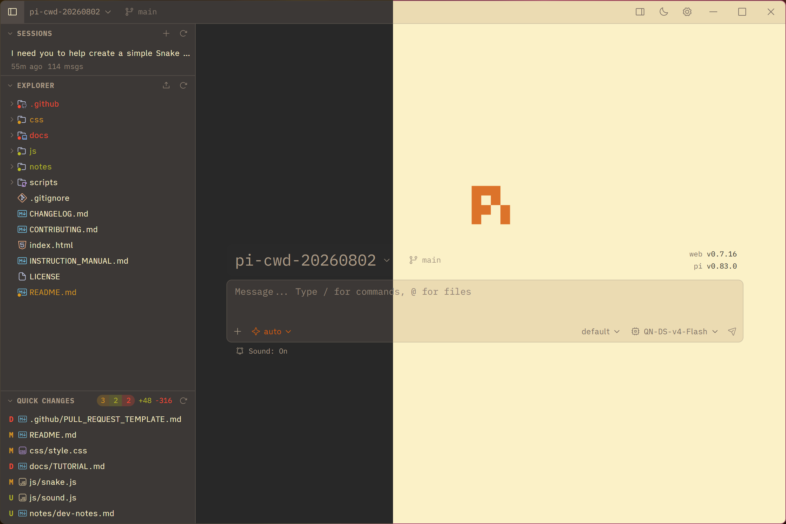
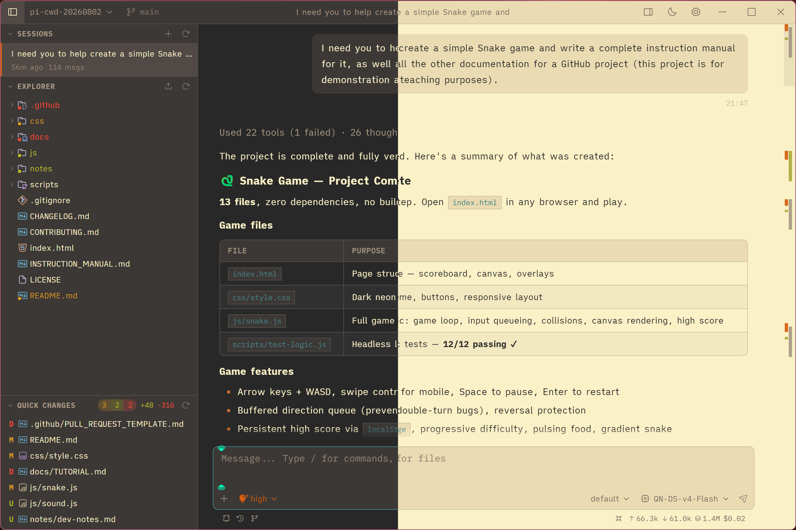
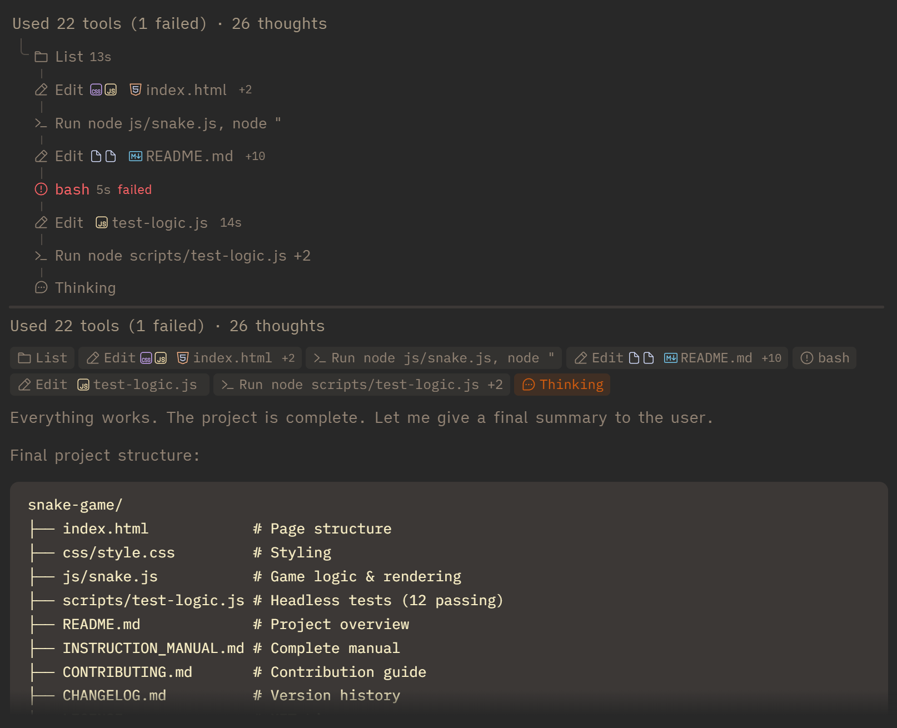
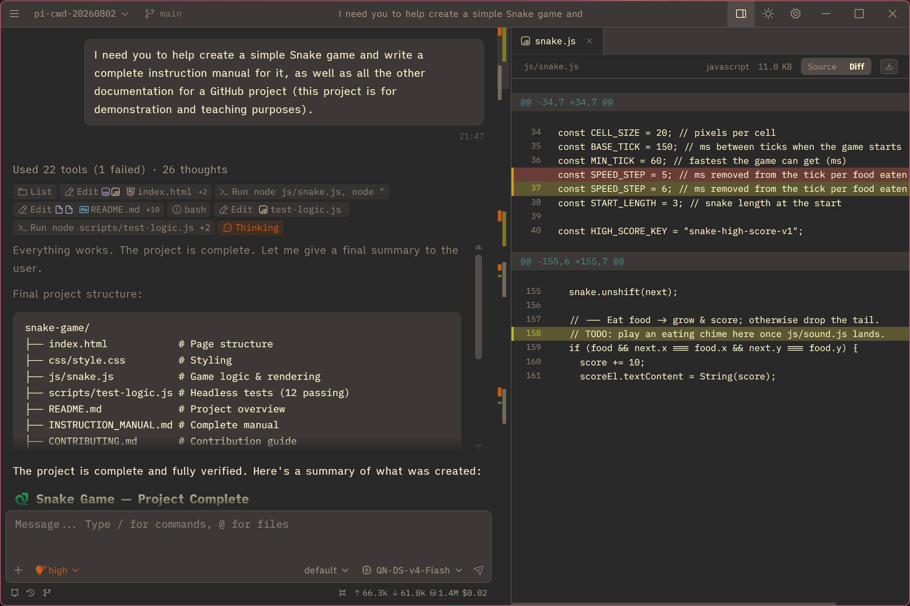

# Pi Web Desktop

[中文文档](./README.zh-CN.md)

<p align="center">
  
</p>

## Origin and purpose

Pi Web Desktop is developed from the `v0.7.16` branch of upstream [pi-web](https://github.com/agegr/pi-web). It is a desktop application client for the [pi coding agent](https://github.com/badlogic/pi-mono).

The project keeps pi-web's local session, model, skill, and file-workspace capabilities, and reworks windows, sidebars, process display, file preview, and theme switching for a desktop workflow.

## Using the desktop app

Download the installer or portable build for your platform from this project's GitHub Releases, then install or extract it and launch the application. 

## Highlights

- **Refined desktop UI/UX**: clearer information hierarchy, improved workspace and sidebar interactions, and a more polished visual system for sessions, projects, and files.
- **Enhanced Markdown and process display**: improved reading styles for Markdown, tool calls, and long conversations; a distinctive multi-step group UI, two process-display modes, and an improved session navigator for orienting within context.
- **PI-TUI theme compatibility**: loads and adapts pi / PI-TUI theme JSON files, with custom theme selection across dark and light modes.
- **Desktop workspace integration**: session browsing and branching, Git worktrees, project-file preview, and model/skill configuration work alongside native folder selection, window controls, and tray interactions.

## Screenshots

Main workspace (dark on the left, light on the right):



Chat with multi-step process groups (dark on the left, light on the right):



Process steps grouped by tool call:



File diff preview:



## Themes

Pi Web Desktop supports pi theme JSON files. Refer to the [official pi theme documentation](https://pi.dev/docs/latest/themes) for the complete format, color variables, and field definitions.

### Theme locations

Place `.json` theme files in `~/.pi/agent/themes/`

After selecting a theme in the app, the appropriate variant is resolved for the active light or dark mode.

### Naming and variants

Themes are grouped by base name. The `-dark.json` and `-light.json` suffixes identify the dark and light variants:

```text
gruvbox-dark.json
gruvbox-light.json
```

These files form one `gruvbox` theme set. Providing paired dark and light files is recommended so dark, light, and system modes remain consistent. A single `theme-name.json` file is also supported, but the app must fall back to that file or the opposite variant when a matching variant is unavailable.

[`docs/themes/`](./docs/themes/) contains complete example pairs that can be copied or used as references:

- `gruvbox-dark.json` / `gruvbox-light.json`
- `solarized-dark.json` / `solarized-light.json`

## Relationship to upstream pi-web

This repository is a desktop-focused derivative of upstream pi-web `v0.7.16`, not an upstream mirror or an official replacement. Upstream improvements may be adopted selectively when they fit this project's architecture and desktop experience. **It does not guarantee complete feature parity with upstream pi-web or full synchronization with upstream releases and changes.**

## Notes

- **Data directory**: pi-web reads `~/.pi/agent/sessions` by default. Set `PI_CODING_AGENT_DIR` to point at another pi agent directory.
- **Session files**: files are stored as `~/.pi/agent/sessions/<encoded-cwd>/<timestamp>_<uuid>.jsonl`.
- **Model config**: the Models panel reads and writes `models.json` in the pi agent directory. Model lists and defaults come from pi's config.
- **File access**: file browsing and preview are scoped to the selected project directory and working directories that appear in sessions.
- **Git worktrees**: see [Worktrees in pi-web](./docs/worktrees.md) for when the switcher appears, how new worktrees are created, and what removal does.
- **Forks vs in-session branches**: Fork creates a new `.jsonl` file. "Edit from here" creates another branch inside the same session file.
- **Network access**: pi-web listens on `127.0.0.1` by default. If you bind it to a LAN address, set `PI_WEB_PASSWORD` and use HTTPS or a trusted VPN; HTTP Basic Auth does not encrypt credentials.

## Development

```bash
npm install
npm run dev
```

The local dev server runs at [http://localhost:30141](http://localhost:30141).

Common checks:

```bash
node_modules/.bin/tsc --noEmit
npm run lint
npm test
```

Avoid running `next build` / `npm run build` during local development. It writes to `.next/` and can interfere with the dev server; leave builds for release work.


## Project Structure

```text
app/
  api/
    agent/          # creates/drives AgentSession and exposes SSE events
    auth/           # OAuth and API key management
    cwd/validate/   # custom working directory validation
    default-cwd/    # pi default working directory lookup
    files/          # file listing, reading, preview, and watching
    home/           # current user home directory
    models/         # available models, default model, thinking levels
    models-config/  # read/write models.json and test models
    sessions/       # session reads, rename, delete, context, HTML export
    skills/         # skill listing, search, install, enable/disable
components/
  AppShell.tsx        # main layout, URL state, top panels, file tabs
  SessionSidebar.tsx  # project selector, session tree, Explorer
  ChatWindow.tsx      # messages, SSE, image drag/drop, minimap
  ChatInput.tsx       # input bar, model/tools/thinking/compact/slash controls
  MessageView.tsx     # message, thinking, tool call/result rendering
  ModelsConfig.tsx    # model and auth configuration panel
  SkillsConfig.tsx    # skill management panel
  FileExplorer.tsx    # file tree
  FileViewer.tsx      # source, diff, image, audio, PDF, DOCX preview
lib/
  rpc-manager.ts      # AgentSessionWrapper lifecycle and global registry
  session-reader.ts   # parses .jsonl session files and branch contexts
  normalize.ts        # normalizes toolCall field names
  file-access.ts      # file read safety boundary
  file-paths.ts       # path encoding and relative path helpers
  markdown.ts         # Markdown/Mermaid/KaTeX plugin configuration
  pi-types.ts         # pi-related types
hooks/
  useAgentSession.ts  # session loading, command sending, SSE state machine
  useAudio.ts         # completion sound
  useDragDrop.ts      # image drag/drop
  useTheme.ts         # theme switching
```
